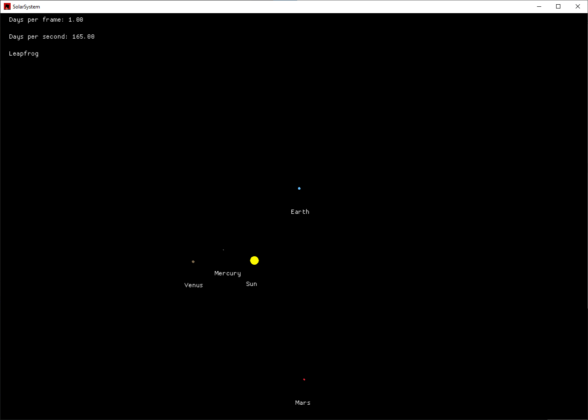

### A simple simulation of the Solar System

The simulation uses the [Macroquad](https://github.com/not-fl3/macroquad/tree/master) game engine for rendering.

The ODE solver used for calculating the evolution of the system can be changed at runtime.

Controls:

* Arrows to pan camera
* Numpad `+` / `-` to zoom
* `,` to slow down the passage of time
* `.` to speed up the passage of time
* `1` to use the Leapfrog integrator
* `2` to use semi-implicit Euler integrator
* `3` to use the standard Euler integrator (not symplectic so the orbits deteriorate quickly)

Simulation precision is the same regardless of speed setting (more time steps are calculated per frame)

I wrote this project to learn basic Rust syntax so it's probably far from utilizing the best practices for this language.